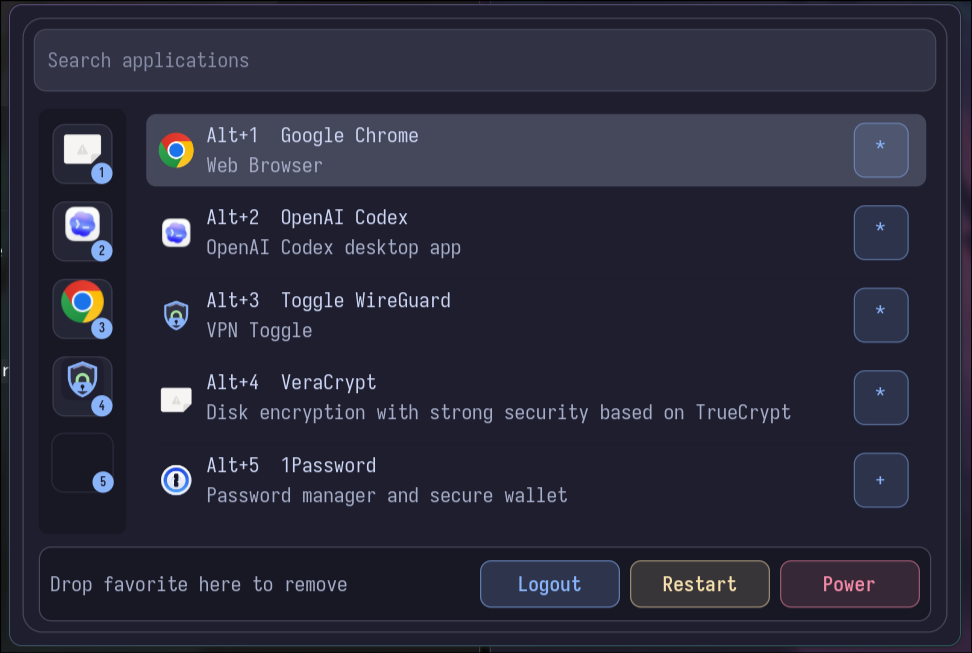

# Helto Launcher

Helto Launcher is a small Rust/GTK4 application launcher for Arch Linux and Hyprland. It is built for a search-first Wayland workflow: open it from a keybind, type immediately, launch, and get out of the way.

## Preview



## Requirements

- Rust stable
- GTK4 runtime and development files
- A Wayland session, normally Hyprland
- Optional: `pkexec` and a running polkit agent for privileged app launches

On Arch Linux:

```sh
sudo pacman -S rust gtk4 pkgconf polkit
```

## Running Locally

```sh
cargo run --
```

Install from the checkout:

```sh
cargo install --path .
```

Example Hyprland keybind:

```text
bind = SUPER, SPACE, exec, helto-launcher
```

GTK asks the compositor for focus when the window is presented, but Wayland compositors have the final say. If centering or focus needs help, use Hyprland window rules.

Current Hyprland named-rule example:

```lua
hl.window_rule({
  match = { class = "helto-launcher" },
  float = true,
  center = true,
  stay_focused = true
})
```

Older Hyprland configs may still use legacy `windowrule` syntax; check the Hyprland documentation for the version you run.

## Configuration

Config path:

```text
$XDG_CONFIG_HOME/helto-launcher/config.toml
~/.config/helto-launcher/config.toml
```

State path:

```text
$XDG_STATE_HOME/helto-launcher/state.toml
~/.local/state/helto-launcher/state.toml
```

Themes are loaded from:

```text
$XDG_CONFIG_HOME/helto-launcher/themes/
~/.config/helto-launcher/themes/
themes/
```

Minimal config:

```toml
theme = "catppuccin-mocha"

[commands]
logout = ["systemctl", "--user", "exit"]
restart = ["systemctl", "reboot"]
poweroff = ["systemctl", "poweroff"]

[privileged_apps]
"org.example.AdminTool.desktop" = true
```

The bundled initial theme is `themes/catppuccin-mocha.toml` and uses Catppuccin Mocha-inspired colors.

## Desktop Apps

Applications are discovered from XDG `.desktop` locations:

- `$XDG_DATA_HOME/applications`
- `~/.local/share/applications`
- `$XDG_DATA_DIRS/applications`
- `/usr/local/share/applications`
- `/usr/share/applications`

Entries with `NoDisplay=true`, `Hidden=true`, missing `Name`, or missing/invalid `Exec` are ignored. `Exec` lines are tokenized directly and launched with `std::process::Command`; they are not passed through a shell.

## Search And Favorites

When the search box is empty, apps are sorted by launch count descending, then name. Launch counts are recorded in the state file.

When searching, matches are ranked by:

1. exact or prefix name match
2. name contains
3. keyword match
4. generic name or comment match
5. small fuzzy match

The favorites rail supports up to five apps. Press `Ctrl+1` through `Ctrl+5` to launch a visible favorite. Use the small favorite button in the result list to add or remove an app. Favorites can be reordered by dragging within the rail and removed through the remove target at the bottom. Some compositors/toolkit versions do not reliably report a drag outside the window, so the explicit remove target is the stable removal path.

## Keyboard Shortcuts

```text
typing       search
Enter        launch selected result
Esc          close
ArrowDown    select next result
ArrowUp      select previous result
Ctrl+n       select next result
Ctrl+p       select previous result
Ctrl+1-5     launch favorite in that slot
Alt+1-Alt+9  launch visible result
Ctrl+q       logout
Ctrl+r       restart
Ctrl+Shift+q power off
```

Logout, restart, and poweroff require pressing the action twice.

## Privilege Elevation

Privileged apps are configured by desktop id:

```toml
[privileged_apps]
"org.example.AdminTool.desktop" = true
```

Those apps are launched as:

```text
pkexec <desktop-entry-command> <args>
```

The launcher does not collect, store, pass, print, or log passwords. Authentication is handled by your polkit agent. If no polkit agent is running, `pkexec` will fail and the launcher will show the error.

## Known Limitations

- GTK and Wayland can request focus and presentation, but Hyprland controls the final focus and placement behavior.
- Terminal desktop entries are launched directly; configure terminal apps with an `Exec` command that opens the desired terminal.
- Dragging favorites outside the launcher window may not be delivered consistently by every compositor/toolkit combination; use the remove target for predictable removal.
